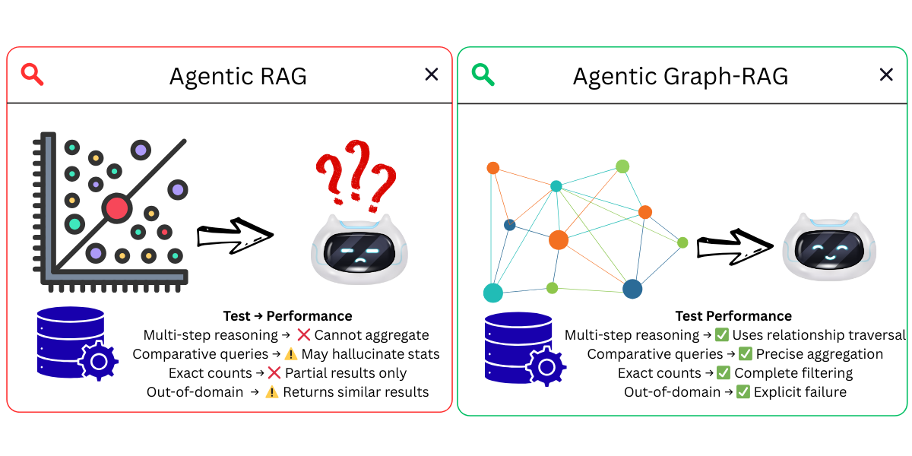
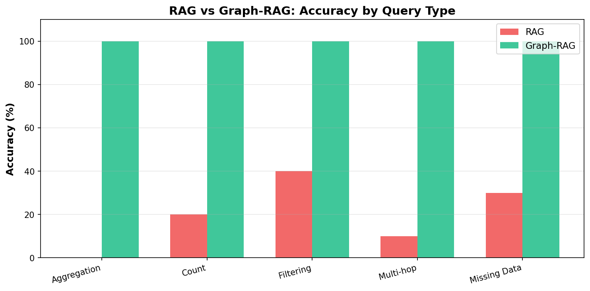
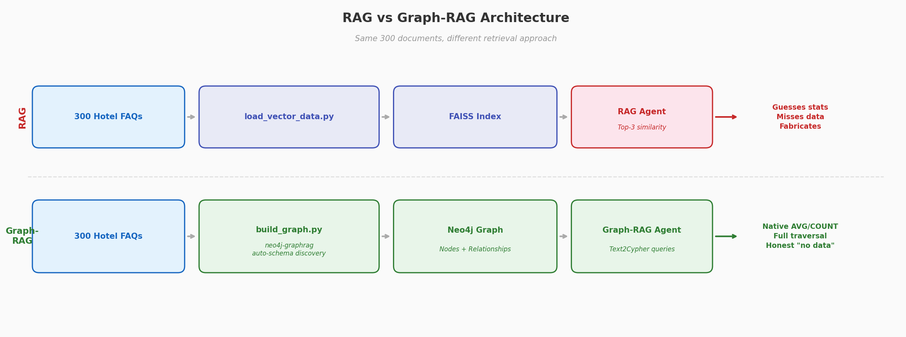

[< Back to Main README](../README.md)

# RAG vs Graph-RAG: Reducing Agent Hallucinations

[](https://python.org)
[](https://strandsagents.com)
[](https://neo4j.com)
[](https://github.com/facebookresearch/faiss)

> Traditional RAG makes AI agents hallucinate statistics and aggregations. This demo compares RAG (FAISS) vs Graph-RAG (Neo4j) on 300 hotel FAQ documents to measure which approach reduces hallucinations.



## Research Background

Based on recent papers:
- [RAG-KG-IL: Multi-Agent Hybrid Framework for Reducing Hallucinations](https://arxiv.org/pdf/2503.13514) — KG reduces hallucinations by 73% vs standalone LLMs
- [MetaRAG: Metamorphic Testing for Hallucination Detection](https://arxiv.org/pdf/2509.09360) — Proves hallucinations are inherent to LLMs
- [RAKG: Document-level Retrieval Augmented Knowledge Graph Construction](https://arxiv.org/pdf/2504.09823v1) — Automated KG construction from text

## 🎯 What This Demo Shows

Research ([RAG-KG-IL, 2025](https://arxiv.org/pdf/2503.13514)) identifies three types of RAG hallucinations:

1. **Fabricated statistics** — LLM generates plausible-sounding numbers from text chunks instead of computing them (paper shows 73% more hallucinations without KG)
2. **Incomplete retrieval** — Vector search returns top-k documents, missing data scattered across hundreds of documents (paper found 54 instances of missing information with RAG-only)
3. **Out-of-domain fabrication** — When no relevant data exists, RAG returns similar-looking results and the LLM fabricates an answer ([MetaRAG](https://arxiv.org/pdf/2509.09360))

Graph-RAG solves this with:
- **Native aggregations** — `AVG()`, `COUNT()` computed in the database, not guessed
- **Relationship traversal** — Cypher queries follow exact paths (Hotel → Room → Amenity)
- **Explicit failure** — Empty results when data doesn't exist, no fabrication

## 📊 Key Findings

| Capability | RAG | Graph-RAG |
|------------|-----|-----------|
| Aggregations (avg, count) | ❌ Cannot compute | ✅ Native database operations |
| Multi-hop reasoning | ❌ Limited to top-k docs | ✅ Relationship traversal |
| Counting across documents | ❌ Only sees 3 docs | ✅ Precise COUNT() |
| Missing data handling | ❌ Fabricates answers | ✅ Honest "no results" |



## Architecture



Two agents query the same 300 hotel FAQs with different approaches:
- **RAG Agent** → FAISS similarity search → top 3 docs → LLM summarizes
- **Graph-RAG Agent** → LLM writes Cypher (Text2Cypher) → Neo4j executes → precise results

## 🚀 Quick Start

### Prerequisites

- Python 3.9+
- Neo4j Desktop with APOC plugin
- OpenAI API key

### 1. Install Dependencies

```bash
uv venv && uv pip install -r requirements.txt
```

### 2. Configure Environment Variables

Create a `.env` file with your credentials:

```bash
# OpenAI API Key (required)
OPENAI_API_KEY=your_openai_api_key_here

# Neo4j Configuration (required for Graph-RAG demo)
NEO4J_URI=neo4j://127.0.0.1:7687
NEO4J_USER=neo4j
NEO4J_PASSWORD=your_neo4j_password_here
```

**How to get credentials:**
- **OpenAI API Key**: Get from [platform.openai.com/api-keys](https://platform.openai.com/api-keys)
- **Neo4j Password**: The password you set when creating your database in Neo4j Desktop or during Neo4j installation

### 3. Extract Data

```bash
unzip hotel-faqs.zip -d data/
```

### 4. Build Data Stores

**Option A: LITE Version (Recommended for Testing - ~10-15 minutes)**

Process only 30 documents (10% of dataset) for quick testing:

```bash
# Build FAISS vector index (fast, ~30 seconds)
uv run load_vector_data_lite.py

# Build Neo4j knowledge graph (~10-15 minutes)
uv run build_graph_lite.py
```

**Option B: Full Version (~2 hours)**

Process all 300 documents for complete dataset:

```bash
# Build FAISS vector index (fast, ~1 min)
uv run load_vector_data.py

# Build Neo4j knowledge graph (slower, ~2 hours - uses LLM for entity extraction)
uv run build_graph.py
```

### 5. Run Demo

```bash
uv run travel_agent_demo.py
```


## 🔧 How It Works

### Two Agents, Same Data

The demo creates **two agents** that query the same 300 hotel FAQs:

```python
# Traditional RAG Agent - uses vector search
rag_agent = Agent(
    name="RAG_Agent",
    tools=[search_faqs],  # FAISS similarity search
    model=OpenAIModel("gpt-4o-mini")
)

# Graph-RAG Agent - uses knowledge graph
graph_agent = Agent(
    name="GraphRAG_Agent", 
    tools=[query_knowledge_graph],  # Cypher queries on Neo4j
    model=OpenAIModel("gpt-4o-mini")
)
```

### How the Knowledge Graph is Built

The graph is built **automatically** using `neo4j-graphrag` — no hardcoded schema:

```python
from neo4j_graphrag.experimental.pipeline.kg_builder import SimpleKGPipeline

# No entities/relations defined — LLM discovers them from text
kg_builder = SimpleKGPipeline(
    llm=llm,
    driver=neo4j_driver,
    embedder=embedder,
    from_pdf=False,
    perform_entity_resolution=True,  # dedup similar entities
)

# Process each document
await kg_builder.run_async(text=document_text)
```

The LLM reads each document and:
1. **Discovers entity types** (Hotel, Room, Amenity, Policy, Service)
2. **Extracts relationships** (HAS_ROOM, OFFERS_AMENITY, HAS_POLICY)
3. **Resolves duplicates** (merges similar entities into single nodes)

If you add new documents with new entity types (Restaurant, Airport, etc.), the LLM discovers them automatically.

## 📚 Technologies

| Technology | Purpose |
|------------|---------|
| [Strands Agents](https://strandsagents.com) | AI agent framework |
| [neo4j-graphrag](https://neo4j.com/docs/neo4j-graphrag-python/current/) | Automatic knowledge graph construction |
| [Neo4j](https://neo4j.com) | Graph database |
| [FAISS](https://github.com/facebookresearch/faiss) | Vector similarity search |
| [SentenceTransformers](https://www.sbert.net/) | Text embeddings (runs locally, no API costs — swap for any embedding provider) |


## 🔍 Troubleshooting

**APOC not found:** Install APOC plugin in Neo4j Desktop and restart

**Graph build slow:** Each document takes ~30s (LLM extraction). 300 docs ≈ 2.5 hours. Run once.

**API errors:** Check has valid `OPENAI_API_KEY`

**Model alternatives:** All demos work with OpenAI, Anthropic, or Ollama — see [Strands Model Providers](https://strandsagents.com/docs/user-guide/concepts/model-providers/)

This demo uses Strands Agents. The same Graph-RAG pattern (knowledge graph + Text2Cypher) can be implemented with LangGraph, CrewAI, AutoGen, Haystack, or any framework that supports custom tool calling.

---

## Frequently Asked Questions

### How much better is Graph-RAG than traditional RAG at preventing hallucinations?

Research ([RAG-KG-IL, 2025](https://arxiv.org/pdf/2503.13514)) shows knowledge graphs reduce hallucinations by 73% compared to standalone LLMs. In this demo, Graph-RAG correctly answers aggregation queries (averages, counts) and multi-hop questions that traditional RAG consistently gets wrong by fabricating statistics from text chunks.

### Do I need to define a schema for the knowledge graph?

No. The graph is built automatically using `neo4j-graphrag`'s `SimpleKGPipeline`. The LLM reads each document and discovers entity types (Hotel, Room, Amenity, Policy), extracts relationships, and resolves duplicates — no hardcoded schema required. New entity types are discovered automatically when you add new documents.

### How long does it take to build the knowledge graph?

The lite version (30 documents) takes approximately 15 minutes. The full version (300 documents) takes approximately 2 hours because each document requires LLM-based entity extraction (~30 seconds per document). You only need to build it once.

---

## Next Demo

[Demo 02 - Semantic Tool Selection](../02-semantic-tools-demo/) — Reduce token waste and wrong tool picks with FAISS-based semantic filtering.

---

## Security

If you discover a potential security issue in this project, notify AWS/Amazon Security via the [vulnerability reporting page](https://aws.amazon.com/security/vulnerability-reporting/?trk=87c4c426-cddf-4799-a299-273337552ad8&sc_channel=el). Please do **not** create a public GitHub issue.

---

## License

This library is licensed under the MIT-0 License. See the [LICENSE](../LICENSE) file for details.
