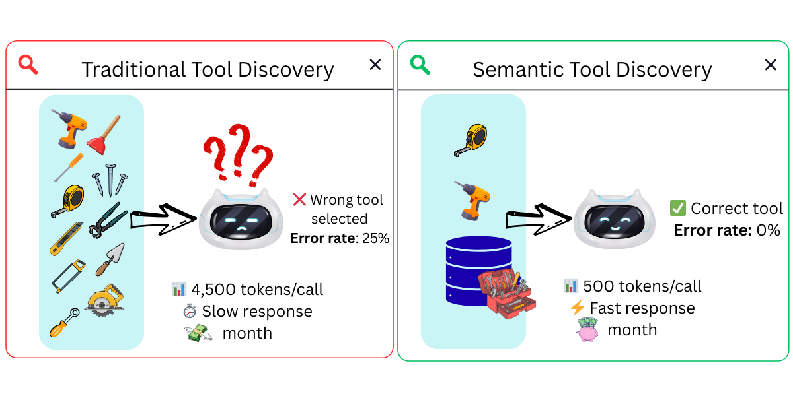
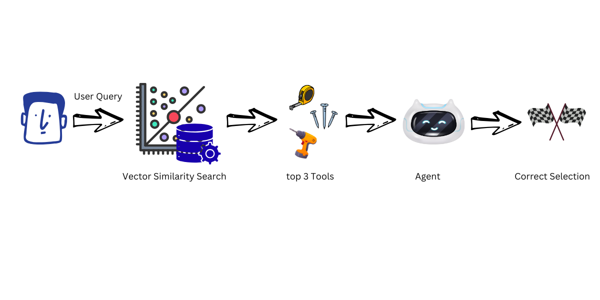
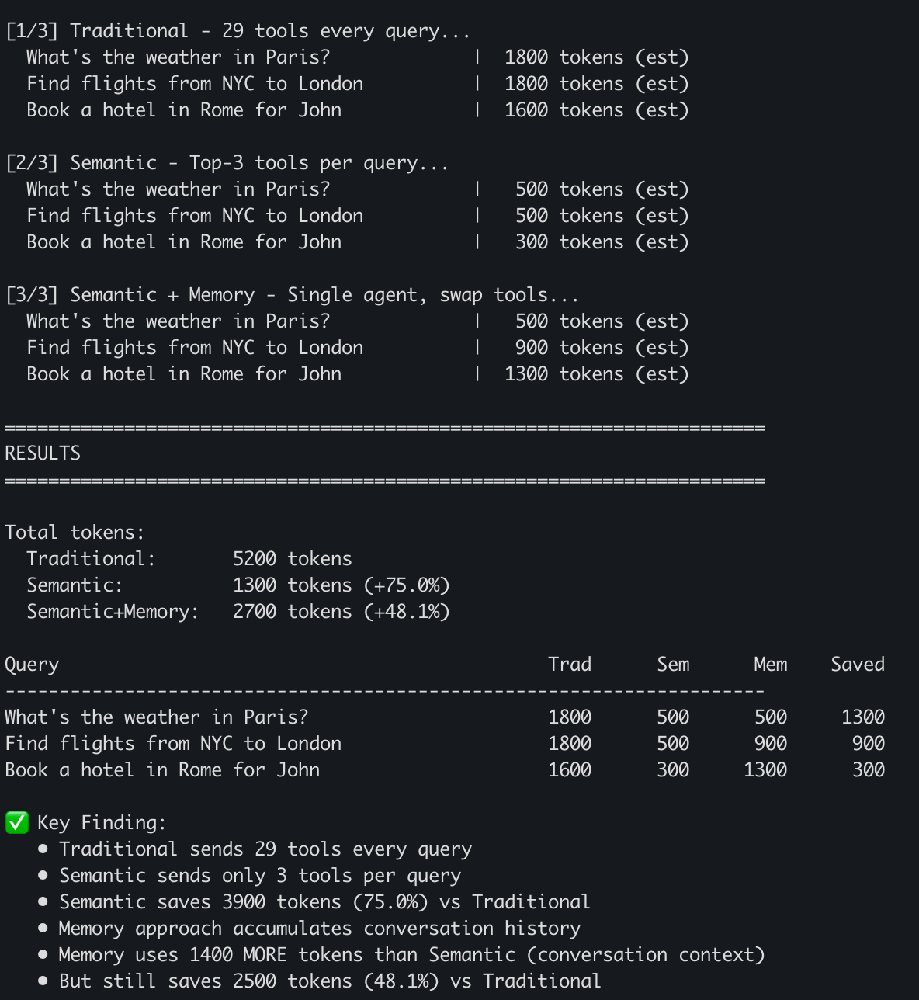
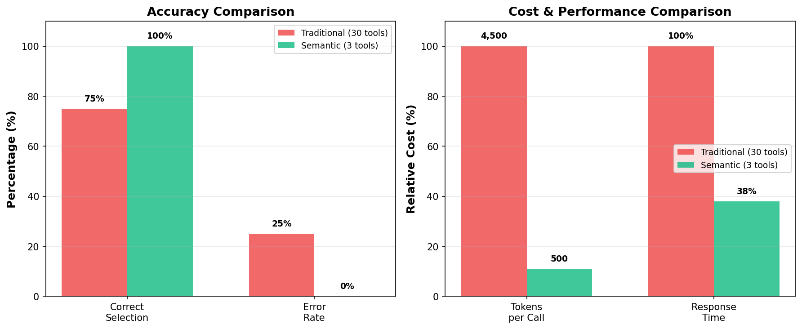

[< Back to Main README](../README.md)

# Semantic Tool Selection: Reducing Agent Hallucinations

[](https://python.org)
[](https://strandsagents.com)
[](https://github.com/facebookresearch/faiss)



**AI agents with many similar tools pick the wrong one and waste tokens. This demo builds a travel agent with Strands Agents and uses FAISS to filter 29 tools down to the top 3 most relevant, comparing filtered vs unfiltered tool selection accuracy.**

Based on research: ["Internal Representations as Indicators of Hallucinations in Agent Tool Selection"](https://arxiv.org/abs/2601.05214)

## The Problem

Research ([Internal Representations, 2025](https://arxiv.org/abs/2601.05214)) identifies 5 critical agent failure modes when tools scale:

1. **Function selection errors** - Calling non-existent tools
2. **Function appropriateness errors** - Choosing semantically wrong tools
3. **Parameter errors** - Malformed or invalid arguments
4. **Completeness errors** - Missing required parameters
5. **Tool bypass behavior** - Generating outputs instead of calling tools

**The dual problem**:
- ❌ **Hallucination risk**: More tools = more inappropriate selections
- ❌ **Token waste**: Sending all tool descriptions on every call (29 tools = ~4,000 tokens per query)

## The Solution

Semantic tool selection filters tools **before** the agent sees them:



**Results**: Improved accuracy, fewer tokens

### Why Strands Agents Makes This Production-Ready

Strands Agents provides native capabilities that enable semantic tool selection in production:

**1. Dynamic Tool Swapping**
```python
# Add/remove tools at runtime without recreating the agent
agent.tool_registry.register_tool(new_tool)
agent.tool_registry.unregister_tool(old_tool)
```

**2. Conversation Memory Preservation**
```python
# Swap tools between queries while keeping conversation history
swap_tools(agent, new_tools)  # agent.messages preserved
```

**3. Runtime Tool Discovery**
- Agent picks up tool changes automatically at each event loop
- No manual refresh needed—just modify `tool_registry`
- Zero-downtime tool updates in production

Traditional frameworks require agent recreation to change tools, losing conversation state. Strands maintains memory while tools change dynamically.

Learn more: [Strands Tool Registry](https://strandsagents.com/docs/user-guide/concepts/tools/)

## Setup

### Prerequisites

- Python 3.9+
- [Strands Agents](https://strandsagents.com) — AI agent framework
- Optional: Neo4j connection for real hotel data (from `../01-hotel-rag-demo`)

### Model

This demo uses OpenAI with GPT-4o-mini by default (requires `OPENAI_API_KEY` environment variable).

You can swap the model for any provider supported by Strands — Amazon Bedrock, Anthropic, Ollama, etc. See [Strands Model Providers](https://strandsagents.com/docs/user-guide/concepts/model-providers/) for configuration.

### Configure Environment Variables

Create a `.env` file with your OpenAI API key:

```bash
# OpenAI API Key (required)
OPENAI_API_KEY=your_openai_api_key_here
```

**How to get your API key**: Get from [platform.openai.com/api-keys](https://platform.openai.com/api-keys)

### Install

```bash
uv venv && uv pip install -r requirements.txt
```

## Files

| File | Purpose |
|------|---------|
| `test_semantic_tools_hallucinations.ipynb` | **Main demo** - Comprehensive notebook with 29 tools, ground truth verification |
| `token_comparison_app.py` | **Token savings verification** - Standalone script to measure token reduction |
| `enhanced_tools.py` | 31 travel agent tools (29 generic + 2 with optional Neo4j data) |
| `registry.py` | FAISS-based semantic tool filtering |

## Run the Demo

```bash
Open `test_semantic_tools_hallucinations.ipynb` in your IDE (VS Code, Kiro, or any editor with notebook support).
```

**What it does**:
1. Tests 13 travel queries on 29 tools
2. Compares Traditional (all 29 tools) vs Semantic (top 3 filtered)
3. Verifies against ground truth (real hotel database)
4. Shows token savings and error reduction

**Key features**:
- Real hotel data from Neo4j graph database
- Objective accuracy measurement
- Detailed error analysis
- Token cost comparison

## Verify Token Savings

Run the standalone token comparison script to verify the savings claimed in Part 3 of the notebook:

```bash
uv run token_comparison_app.py
```

**What it measures**:
- Compares 3 approaches: Traditional, Semantic, Semantic+Memory
- Shows actual token usage per query
- Demonstrates memory accumulation cost
- Verifies `swap_tools()` preserves conversation history

**Expected output**:





**Token breakdown**:
- **Traditional**: 29 tools × 50 tokens = ~1450 tokens/query (constant)
- **Semantic**: 3 tools × 50 tokens = ~150 tokens/query (constant)
- **Memory**: ~150 tokens + conversation history (~400 tokens/turn, accumulates)

## How It Works

### Traditional Approach (Baseline)
```python
# Agent sees ALL 31 tools on every query
agent = Agent(tools=ALL_TOOLS, model=model)
agent("How much does Hotel Marriott cost?")
# Token cost: ~4,500 tokens (31 tool descriptions)
# Risk: Picks wrong tool from 31 options
```

### Semantic Approach (Optimized)
```python
# 1. Build FAISS index once
build_index(ALL_TOOLS)

# 2. Filter tools per query
query = "How much does Hotel Marriott cost?"
relevant_tools = search_tools(query, top_k=3)
# Returns: [get_hotel_pricing, get_hotel_details, search_hotels]

# 3. Agent sees only 3 relevant tools
agent = Agent(tools=relevant_tools, model=model)
agent(query)
# Token cost: ~500 tokens (3 tool descriptions)
# Risk: Picks correct tool from 3 focused options
```

### Production Pattern: Preserving Conversation Memory

For multi-turn conversations, use Strands' native tool swapping to maintain conversation history:

```python
def swap_tools(agent, new_tools):
    """Swap agent's tools without losing conversation memory"""
    agent.tool_registry.registry.clear()
    agent.tool_registry.dynamic_tools.clear()
    for tool in new_tools:
        agent.tool_registry.register_tool(tool)

# Create agent once
agent = Agent(tools=initial_tools, model=model)

# Multi-turn conversation with dynamic tool filtering
for query in queries:
    selected = search_tools(query, top_k=3)
    swap_tools(agent, selected)  # Tools change, agent.messages preserved
    agent(query)  # Full conversation history intact
```

**Why this works**: Strands calls `tool_registry.get_all_tools_config()` at each event loop cycle, automatically picking up runtime changes. No agent recreation needed.

**Key advantages**:
- Zero conversation loss across tool swaps
- Same agent instance handles all queries
- Add/remove tools between any two queries
- Production-ready for long conversations

Learn more: [Strands Agent Architecture](https://strandsagents.com/docs/user-guide/concepts/agents/)

- [Search for tools in your Amazon Bedrock AgentCore gateway with a natural language query](https://docs.aws.amazon.com/bedrock-agentcore/latest/devguide/gateway-using-mcp-semantic-search.html?trk=87c4c426-cddf-4799-a299-273337552ad8&sc_channel=el)

## Enhanced Tools with Real Data

The notebook includes 6 tools connected to the Neo4j hotel database:

```python
@tool
def search_real_hotels(country: str, min_rating: float = 0.0) -> str:
    """Search real hotels in a specific country from our database."""
    # Executes Cypher query on Neo4j
    # Returns actual hotel data from 515K reviews

@tool
def get_top_hotels(country: str, limit: int = 5) -> str:
    """Get top-rated hotels in a country."""
    # Real aggregation from graph database
```

These tools provide **ground truth** for objective accuracy measurement.

## Research Background

This demo implements findings from:
- [Internal Representations as Indicators of Hallucinations](https://arxiv.org/abs/2601.05214) - Tool selection hallucinations increase with tool count
- Production systems report 89% token reduction ([rconnect.tech](https://www.rconnect.tech/blog/semantic-tool-selection-guide))

## Frequently Asked Questions

### How much does semantic tool selection reduce token usage?

Semantic filtering reduces token consumption by approximately 89%. Instead of sending all 29 tool descriptions (~1,450 tokens) on every query, FAISS-based filtering selects the top 3 relevant tools (~150 tokens). This reduction is constant per query and compounds across multi-turn conversations.

### Does filtering tools break conversation memory?

No. Strands Agents' `swap_tools()` function changes the available tools at runtime without recreating the agent, preserving the full conversation history in `agent.messages`. This is a key production advantage over frameworks that require agent recreation to change tools.

### Can I use semantic tool selection with other agent frameworks?

Yes. The core pattern — embedding tool descriptions with FAISS and filtering by cosine similarity before the LLM sees them — is framework-agnostic. You can implement it in LangGraph, CrewAI, AutoGen, or any framework. Amazon Bedrock AgentCore Gateway also provides built-in [MCP semantic routing](https://docs.aws.amazon.com/bedrock-agentcore/latest/devguide/gateway-using-mcp-semantic-search.html?trk=87c4c426-cddf-4799-a299-273337552ad8&sc_channel=el) for production workloads.

---

## Navigation

- **Previous:** [Demo 01 - Graph-RAG vs RAG](../01-faq-graphrag-demo/)
- **Next:** [Demo 03 - Multi-Agent Validation](../03-multiagent-demo/) — Cross-validate tool selections with Executor → Validator → Critic

---

## Security

If you discover a potential security issue in this project, notify AWS/Amazon Security via the [vulnerability reporting page](https://aws.amazon.com/security/vulnerability-reporting/?trk=87c4c426-cddf-4799-a299-273337552ad8&sc_channel=el). Please do **not** create a public GitHub issue.

---

## License

This library is licensed under the MIT-0 License. See the [LICENSE](../LICENSE) file for details.
