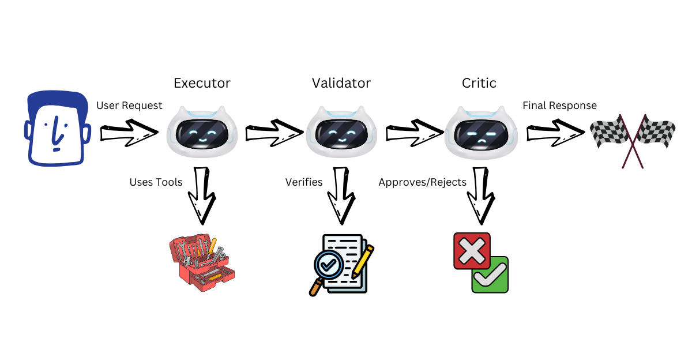

[< Back to Main README](../README.md)

# Multi-Agent Validation: Hallucination Detection with Cross-Validation

[](https://python.org)
[](https://strandsagents.com)
[](https://strandsagents.com/docs/user-guide/concepts/multi-agent/swarm/)

> Single agents hallucinate without detection—they claim success when operations fail and fabricate responses. Multi-agent validation with Executor → Validator → Critic pattern catches these errors through cross-validation. We'll build a travel booking system with Strands Agents Swarm that detects invalid hotels and returns explicit FAILED status instead of hallucinating alternatives.

Based on research: [Teaming LLMs to Detect and Mitigate Hallucinations](https://arxiv.org/pdf/2510.19507)

## The Problem

Research ([Markov Chain Multi-Agent Debate, 2024](https://arxiv.org/html/2406.03075v1)) shows that single agents hallucinate without detection mechanisms:

- **Claim success when operations failed** - No validation layer catches execution errors
- **Use wrong tools for requests** - No cross-check verifies tool appropriateness
- **Fabricate responses** - No second opinion challenges generated content
- **Provide inaccurate statistics** - No verification against ground truth

Single agents operate in isolation. When they hallucinate, there's no mechanism to detect the error before it reaches users.

## The Solution

Multiple specialized agents that validate each other, enhanced with Graph-RAG:


## Quick Start

### Prerequisites
- Python 3.9+
- [Strands Agents](https://strandsagents.com) — AI agent framework

### Model

This demo uses OpenAI with GPT-4o-mini by default (requires `OPENAI_API_KEY` environment variable).

You can swap the model for any provider supported by Strands — Amazon Bedrock, Anthropic, Ollama, etc. See [Strands Model Providers](https://strandsagents.com/docs/user-guide/concepts/model-providers/) for configuration.

### Setup
```bash
uv venv && uv pip install -r requirements.txt
```

### Run Tests

**Option 1: Python Script (Recommended)**
```bash
uv run test_multiagent_hallucinations.py
```

**Option 2: Jupyter Notebook**
```bash
Open `test_multiagent_hallucinations.ipynb` in your IDE (VS Code, Kiro, or any editor with notebook support).
```

The tests include:
- Single agent baseline
- Multi-agent validation
- Hallucination detection (invalid hotels)
- Ground truth verification

## Output Example

```
[TEST 1] Single Agent - Valid Booking
✓ Response: I've booked the grand_hotel for John for 2 nights...

[TEST 2] Single Agent - Invalid Hotel (the_ritz_paris doesn't exist)
⚠️  Response: I've booked the grand_hotel in Paris for Sarah...
    (Agent hallucinated - changed hotel without warning!)

[TEST 3] Multi-Agent - Valid Booking with Validation
✓ Flow: executor → validator → critic → validator → critic
✓ Status: Status.COMPLETED

[TEST 4] Multi-Agent - Invalid Hotel Detection
✓ Flow: executor → validator → critic → validator → critic
✓ Status: Status.FAILED
    (Correctly detected invalid hotel!)
```

## How It Works

**Strands Agents makes this simple**: define what each agent does, and `Swarm` handles all coordination — autonomous handoffs, shared context, explicit `COMPLETED`/`FAILED` status — with no custom orchestration code.

### Basic Multi-Agent
```python
from strands import Agent
from strands.multiagent import Swarm

# Three specialized agents
executor = Agent(name="executor", tools=ALL_TOOLS,
    system_prompt="Execute requests, then hand off to validator")

validator = Agent(name="validator",
    system_prompt="Check for hallucinations. Say VALID or HALLUCINATION")

critic = Agent(name="critic",
    system_prompt="Final review. Say APPROVED or REJECTED")

# Create swarm - agents hand off to each other
swarm = Swarm([executor, validator, critic], entry_point=executor)
result = swarm("Book grand_hotel for John")
```

### Enhanced with Graph-RAG
```python
# Add Graph-RAG tools for structured verification
from graph_tool import search_hotels_by_country, get_top_rated_hotels

executor_graph = Agent(
    name="executor",
    tools=[book_hotel, search_hotels_by_country, get_top_rated_hotels],
    system_prompt="Use graph tools to verify hotel info before booking"
)

validator_graph = Agent(
    name="validator",
    tools=[search_hotels_by_country],  # Can verify against database
    system_prompt="Validate using hotel database"
)

swarm_graph = Swarm([executor_graph, validator_graph, critic], entry_point=executor_graph)
```

## Key Features

- **Shared Context**: All agents see the full task history
- **Autonomous Handoffs**: Agents decide when to pass control
- **Safety Mechanisms**: Max handoffs, timeouts, loop detection
- **Graph-RAG Integration**: Structured data for verification
- **Ground Truth Validation**: Compare against actual database

## Notebook Tests

The `test_multiagent_hallucinations.ipynb` notebook includes:

| Test | What it measures |
|------|------------------|
| TEST 1: Single Agent Baseline | Performance without validation |
| TEST 2: Multi-Agent Validation | Cross-validation effectiveness |
| TEST 3: Multi-Agent + Graph-RAG | Structured data verification (optional) |
| TEST 4: Invalid Hotel Detection | Handling non-existent entities |
| TEST 5: Complex Queries | Multi-step reasoning (optional) |
| TEST 6: Out-of-Domain | Handling missing data (optional) |

**Note**: Tests 3, 5, and 6 require Neo4j with Graph-RAG setup. They will be skipped if not available.

## Results Summary

| Approach | Hallucination Detection | Accuracy | Latency |
|----------|------------------------|----------|---------|
| Single Agent | ❌ None | ⚠️ Fabricates alternatives | ✅ Fast |
| Multi-Agent | ✅ Detects errors | ✅ Validates responses | ⚠️ Slower |
| Multi-Agent + Graph-RAG | ✅ Excellent | ✅ Database verification | ⚠️ Slower |

## Key Findings

1. **Single agents hallucinate**: Changed `the_ritz_paris` to `grand_hotel` without warning
2. **Multi-agent validation works**: Detected invalid hotel, returned FAILED status
3. **Executor → Validator → Critic pattern**: Provides audit trail and cross-validation
4. **Status tracking**: COMPLETED/FAILED makes errors explicit

## Troubleshooting

**OpenTelemetry warnings**: Ignore "Failed to detach context" warnings - they don't affect functionality

**AWS credentials**: Ensure credentials are configured with Amazon Bedrock access

**Graph-RAG tests skipped**: Optional - requires Neo4j setup. Core tests work without it.

## References

- [Teaming LLMs to Detect and Mitigate Hallucinations](https://arxiv.org/pdf/2510.19507)
- [RAG-KG-IL: Multi-Agent Hybrid Framework](https://arxiv.org/pdf/2503.13514)
- [MetaRAG: Metamorphic Testing for Hallucination Detection](https://arxiv.org/pdf/2509.09360)
- [Synergistic Integration in Multi-Agent RAG Systems](https://arxiv.org/html/2511.21729v1)
- [Strands Swarm Documentation](https://strandsagents.com/docs/user-guide/concepts/multi-agent/swarm/)

---

## Frequently Asked Questions

### How does multi-agent validation detect hallucinations that single agents miss?

Single agents operate in isolation — when they hallucinate, there is no mechanism to detect the error. Multi-agent validation uses an Executor-Validator-Critic pipeline where each agent cross-checks the previous one's output. The Validator verifies tool calls against ground truth, and the Critic provides a final pass/fail verdict with explicit COMPLETED or FAILED status.

### What happens when the multi-agent swarm detects a hallucination?

The swarm returns a `Status.FAILED` result with an explanation of what went wrong. For example, when a single agent silently substitutes a non-existent hotel with a different one, the multi-agent swarm detects the invalid hotel and returns FAILED instead of hallucinating an alternative.

### Does multi-agent validation increase latency?

Yes, multi-agent validation adds latency because multiple LLM calls are needed (Executor + Validator + Critic). However, the tradeoff is significantly higher accuracy and an audit trail of cross-validation. For production use, [Demo 06](../06-agentcore-production-demo/) shows how to achieve similar validation with a single `validate_booking_rules` tool backed by DynamoDB for lower latency.

This demo uses Strands Agents Swarm. Similar multi-agent patterns can be implemented in LangGraph, CrewAI, AutoGen, or any framework that supports agent-to-agent handoffs.

---

## Navigation

- **Previous:** [Demo 02 - Semantic Tool Selection](../02-semantic-tools-demo/)
- **Next:** [Demo 04 - Neurosymbolic Guardrails](../04-neurosymbolic-demo/) — Enforce business rules the LLM cannot bypass

---

## Security

If you discover a potential security issue in this project, notify AWS/Amazon Security via the [vulnerability reporting page](https://aws.amazon.com/security/vulnerability-reporting/?trk=87c4c426-cddf-4799-a299-273337552ad8&sc_channel=el). Please do **not** create a public GitHub issue.

---

## License

This library is licensed under the MIT-0 License. See the [LICENSE](../LICENSE) file for details.
