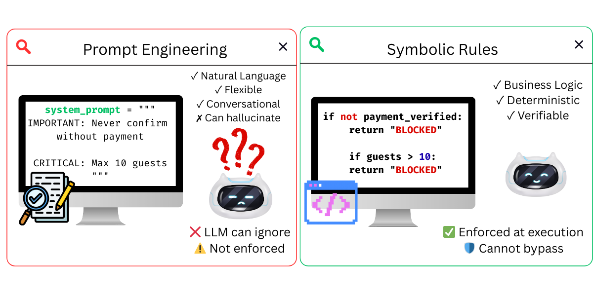

[< Back to Main README](../README.md)

# Neurosymbolic Guardrails: Verifiable Agent Decisions

[](https://python.org)
[](https://strandsagents.com)
[](https://strandsagents.com/docs/user-guide/concepts/agents/hooks/)
> Combines LLM flexibility with symbolic rules for verifiable, constrained decision-making in AI agents.





## The Problem

Research ([ATA: Autonomous Trustworthy Agents, 2024](https://arxiv.org/html/2510.16381v1)) shows that agents hallucinate when business rules are expressed only in natural language prompts:

- **Parameter errors**: Agent calls `book_hotel(guests=15)` despite "Maximum 10 guests" in docstring
- **Completeness errors**: Agent executes bookings without required payment verification
- **Tool bypass behavior**: Agent confirms success without calling validation tools

**Why prompt engineering fails**: Prompts are suggestions, not constraints. Agents can ignore docstring instructions because they're processed as text, not executable rules.

## The Solution: Neurosymbolic Guardrails for AI Agents with Strands Agents Hooks

Neurosymbolic integration combines:
- **Neural (LLM)**: Understands natural language, interprets intent, selects tools
- **Symbolic (Rules)**: Validates constraints, enforces prerequisites, blocks invalid operations
- **Strands Hooks**: Intercept tool calls before execution to enforce rules

**Flow:** User Query **>** LLM (understands) **>** Tool Selection **>** Hook (validates) **>** Execute or Block

**Strands Agents makes this simple**: Just create a hook, define your rules, and attach it to your agent. The framework handles the rest.

## Quick Start

### Prerequisites
- Python 3.9+
- [Strands Agents](https://strandsagents.com) — AI agent framework

### Model

This demo uses OpenAI with GPT-4o-mini by default (requires `OPENAI_API_KEY` environment variable).

You can swap the model for any provider supported by Strands — Amazon Bedrock, Anthropic, Ollama, etc. See [Strands Model Providers](https://strandsagents.com/docs/user-guide/concepts/model-providers/) for configuration.

### Setup

```bash
uv venv && uv pip install -r requirements.txt
uv run test_neurosymbolic_hooks.py
```

## How It Works with Strands Agents

### 1. Define Rules (rules.py)
```python
BOOKING_RULES = [
    Rule(
        name="max_guests",
        condition=lambda ctx: ctx.get("guests", 1) <= 10,
        message="Maximum 10 guests per booking"
    ),
]
```

### 2. Create Validation Hook
```python
from strands.hooks import HookProvider, HookRegistry, BeforeToolCallEvent

class NeurosymbolicHook(HookProvider):
    def register_hooks(self, registry: HookRegistry) -> None:
        registry.add_callback(BeforeToolCallEvent, self.validate)
    
    def validate(self, event: BeforeToolCallEvent) -> None:
        ctx = self._build_context(event.tool_use["name"], event.tool_use["input"])
        passed, violations = validate(self.rules[tool_name], ctx)
        
        if not passed:
            event.cancel_tool = f"BLOCKED: {', '.join(violations)}"
```

### 3. Clean Tools (no validation logic needed)
```python
@tool
def book_hotel(hotel: str, check_in: str, check_out: str, guests: int = 1) -> str:
    """Book a hotel room."""
    return f"SUCCESS: Booked {hotel} for {guests} guests"
```

### 4. Attach Hook to Agent
```python
hook = NeurosymbolicHook(STATE)
agent = Agent(tools=[book_hotel, ...], hooks=[hook])
```

**That's it!** Strands Agents handles the interception, validation, and blocking automatically.

## Key Insight

**Strands Agents makes neurosymbolic integration effortless:**

1. **LLM (Neural)**: Handles natural language understanding and tool selection
2. **Rules (Symbolic)**: Enforce business logic with verifiable code
3. **Hooks (Integration)**: Strands automatically intercepts and validates before execution
4. **Clean Separation**: Tools stay simple, validation stays centralized

The agent uses the LLM to understand "Confirm booking BK001 for me", but the hook validates that payment was verified before allowing the tool to execute. **The LLM cannot bypass these rules.**

## Why Strands Hooks?

✅ **Simple API**: Just implement `HookProvider` and register callbacks  
✅ **Centralized validation**: One hook validates all tools  
✅ **Clean tools**: No validation logic mixed with business logic  
✅ **Type-safe**: Strongly-typed event objects  
✅ **Composable**: Multiple hooks can work together  

## How does neurosymbolic compare to prompt-only guardrails?

| Approach | Enforcement | Bypassable? | Maintainability |
|----------|------------|:-----------:|-----------------|
| **Prompt engineering** | Instructions in system prompt | Yes — LLM can ignore text | Rules mixed with instructions |
| **Tool docstrings** | Constraints in tool descriptions | Yes — processed as text, not code | Scattered across tools |
| **Neurosymbolic hooks** | Python lambdas executed before tool calls | No — code runs regardless of LLM output | Centralized in `rules.py` |

The key insight: prompts are suggestions, but code is enforcement. Hooks intercept tool calls *before* execution and validate parameters against symbolic rules that the LLM cannot bypass.

## Frequently Asked Questions

### What is neurosymbolic AI in the context of agent guardrails?

Neurosymbolic AI combines neural networks (the LLM that understands natural language and selects tools) with symbolic reasoning (executable Python rules that validate constraints). In this demo, the LLM handles user intent while symbolic rules in `rules.py` enforce business logic like maximum guest limits, valid date ranges, and payment prerequisites — creating verifiable, deterministic guardrails.

### Why not put business rules in the prompt or tool docstrings?

Research ([ATA: Autonomous Trustworthy Agents, 2024](https://arxiv.org/html/2510.16381v1)) shows that agents ignore business rules expressed in natural language. An agent may call `book_hotel(guests=15)` despite "Maximum 10 guests" in the docstring, because prompts are suggestions, not constraints. Hooks enforce rules as executable code that runs before every tool call.

### Can I use this pattern with other agent frameworks?

Yes. Any framework that supports lifecycle hooks or middleware (LangGraph callbacks, CrewAI task hooks, AutoGen function wrappers) can implement the same neurosymbolic pattern. The core idea — intercept tool calls and validate parameters against symbolic rules — is framework-agnostic.

## References

- [Enhancing LLMs through Neuro-Symbolic Integration](https://arxiv.org/pdf/2504.07640v1)
- [Agentic Neuro-Symbolic Programming](https://cognaptus.com/blog/2026-01-05-when-llms-stop-guessing-and-start-complying-agentic-neurosymbolic-programming/)
- [Strands Agents Hooks Documentation](https://strandsagents.com/docs/user-guide/concepts/agents/hooks/)

---

## Navigation

- **Previous:** [Demo 03 - Multi-Agent Validation](../03-multiagent-demo/)
- **Next:** [Demo 05 - Agent Control Steering](../05-agent-control-demo/) — Self-correct instead of blocking

---

## Security

If you discover a potential security issue in this project, notify AWS/Amazon Security via the [vulnerability reporting page](https://aws.amazon.com/security/vulnerability-reporting/?trk=87c4c426-cddf-4799-a299-273337552ad8&sc_channel=el). Please do **not** create a public GitHub issue.

---

## License

This library is licensed under the MIT-0 License. See the [LICENSE](../LICENSE) file for details.
