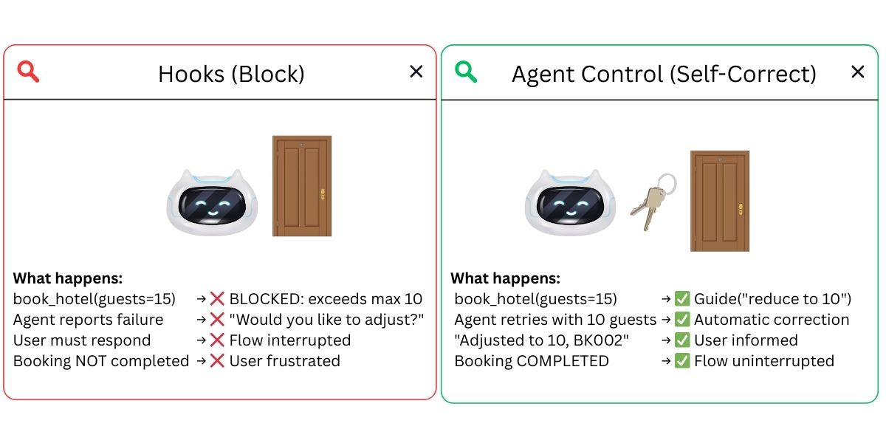
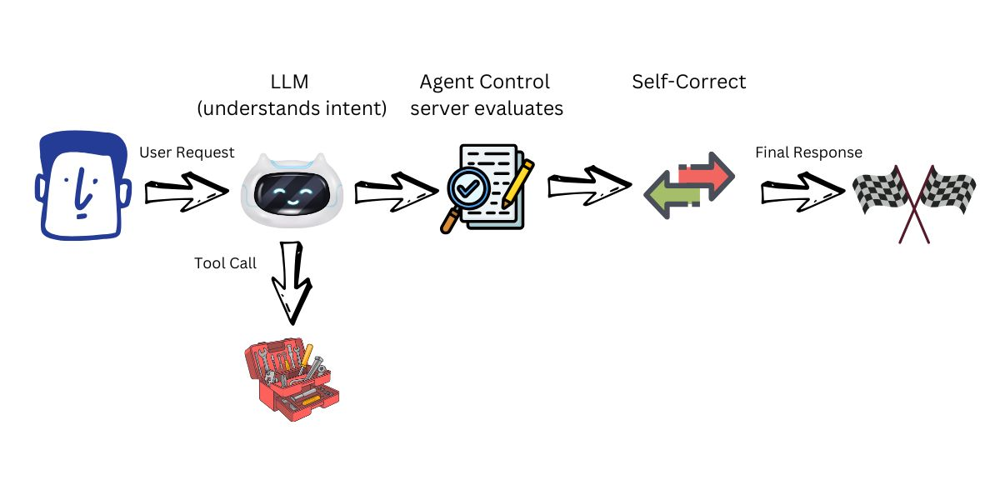

[< Back to Main README](../README.md)

# AI Agent Guardrails That Self-Correct Instead of Block

[](https://python.org)
[](https://strandsagents.com)
[](https://github.com/agentcontrol/agent-control)

> Hooks are functions that run at specific points in an agent's lifecycle. In this demo, hooks intercept tool calls and block them using `cancel_tool` when a business rule is violated. The agent reports failure and the user must retry. Agent Control goes further: it **steers** the agent to fix the problem and complete the task, instead of failing.



Based on: [Strands Agents with Agent Control](https://strandsagents.com/blog/strands-agents-with-agent-control/)

This demo uses Strands Agents and Agent Control. The guardrail patterns demonstrated (hooks, steering, symbolic rules) can be applied with other agent frameworks that support lifecycle hooks.

---

## The Problem with Blocking

[Demo 04 (Neurosymbolic Guardrails)](../04-neurosymbolic-demo/) demonstrates that hooks can enforce business rules at the tool level. When a rule is violated, `cancel_tool` blocks the call and the agent tells the user it cannot proceed.

But blocking alone has limitations. If a user requests 15 guests and the maximum is 10, the agent could adjust to 10 and complete the booking. Instead, with hooks alone, it asks the user to change their request, interrupting the flow.

## The Solution: Steer Instead of Block



[Agent Control](https://github.com/agentcontrol/agent-control) introduces **steer controls** — server-managed policies that guide the agent to self-correct when a violation is detected, instead of terminating the operation:

| Approach | 15 guests requested | Result |
|----------|-------------------|--------|
| **Hooks** | BLOCKED | "Would you like to adjust?" (flow stopped) |
| **Agent Control** | Guide("reduce to 10") | Retries with 10, BK002 confirmed (flow completed) |

## How It Differs from Hooks

| | Hooks ([Demo 04](../04-neurosymbolic-demo/)) | Agent Control (this demo) |
|---|---|---|
| Where rules live | Python code (`rules.py`) | Server — API/dashboard |
| When a rule fails | `cancel_tool = "BLOCKED"` → agent fails | `Guide("reduce to 10")` → agent retries corrected |
| To change a rule | Edit code, redeploy | API call or dashboard — no code changes |
| Integration | `HookProvider` + `hooks=[...]` | `Plugin` + `plugins=[...]` |
| Evaluators | Custom Python lambdas | regex (pattern matching), list (exact value matching), JSON schema (structure validation), AI via Galileo Luna-2 (semantic evaluation) |
| Scope | `BeforeToolCallEvent` only | LLM input/output, tool input/output, pre/post |

## The Tools

Three booking tools in `tools.py` — clean, no validation logic:

| Tool | What it does | Key behavior |
|------|-------------|--------------|
| `book_hotel(hotel, check_in, check_out, guests)` | Books a hotel room | Returns `"SUCCESS: Booking BK001..."` — no guest limit in the tool |
| `process_payment(amount, booking_id)` | Processes payment | Returns `"SUCCESS"` or `"ERROR: Booking not found"` |
| `confirm_booking(booking_id)` | Confirms a booking | Returns `"SUCCESS: Confirmed BK001"` |

The tools do NOT enforce the max-guests rule. That is the guardrail layer's job — either Hooks or Agent Control.

Agent Control integrates as a Plugin with two lines:

```python
# Hooks (existing approach — block):
agent = Agent(tools=[...], hooks=[MaxGuestsHook()])

# Agent Control (new approach — steer):
agent = Agent(tools=[...], plugins=[AgentControlPlugin(...), AgentControlSteeringHandler(...)])
```

## What We Test

Same query, same tools, same model — only the guardrail changes:

| Test | Guardrail | Outcome |
|------|-----------|---------|
| 1 — Hooks | `MaxGuestsHook` with `cancel_tool` | Agent is BLOCKED → asks user what to do |
| 2 — Agent Control | `AgentControlSteeringHandler` with `Guide()` | Agent self-corrects to 10 guests → booking completes |

---

## Two Ways to Define Controls

| Mode | Best for | How it works |
|------|----------|-------------|
| **Server** (this demo) | Teams, production, dashboard management | Controls live on the Agent Control server — change via API or dashboard without redeploying |
| **Local YAML** | Quick prototyping, single-developer projects | Controls defined in a `controls.yaml` file — no server needed, `agent_control.init(controls_file="controls.yaml")` |

This demo uses the **server approach**. See the [Agent Control docs](https://docs.agentcontrol.dev/) for YAML-based local mode or server setup instructions.

---

## Prerequisites

- Python 3.9+
- OpenAI API key — get one at https://platform.openai.com/api-keys (or use any [supported model provider](https://strandsagents.com/docs/user-guide/concepts/model-providers/amazon-bedrock/) such as Amazon Bedrock or Anthropic)
- [Agent Control server](https://docs.agentcontrol.dev/) running locally (see [setup instructions](https://github.com/agentcontrol/agent-control))

---

## Quick Start

### 1. Start Agent Control server

Follow the [Agent Control setup instructions](https://github.com/agentcontrol/agent-control) to start the server locally.

```bash
# Verify it's running
# Replace <PORT> with the Agent Control server port (default: 8000)
curl 127.0.0.1:8000/health
```

### 2. Install dependencies

```bash
uv venv && uv pip install -r requirements.txt
```

### 3. Configure API key

```bash
# Create .env with your OpenAI key
echo "OPENAI_API_KEY=your-key-here" > .env
```

### 4. Setup controls on the server

```bash
uv run setup_controls.py
```

### 5. Run the comparison

```bash
uv run test_hooks_vs_control.py
```

Or open `test_hooks_vs_control.ipynb` in your IDE (VS Code, Kiro, or any editor with notebook support).

---

## Controls Created by setup_controls.py

| Control | Type | Scope | What it does |
|---------|------|-------|-------------|
| `steer-max-guests` | STEER | LLM output (post) | Guides agent to reduce guest count to <= 10 and inform the user |
| `deny-no-payment` | DENY | Tool input (pre) on `confirm_booking` | Blocks booking confirmation without payment |

---

## Expected Output

```
Test 1 — Hooks:          "Would you like to adjust the number of guests?"  (blocked)
Test 2 — Agent Control:  "Adjusted to 10 guests. Booking ID: BK002."      (self-corrected)
```

---

## Cleanup

Stop the Agent Control server following the [shutdown instructions](https://docs.agentcontrol.dev/).

---

## Files

| File | Purpose |
|------|---------|
| `tools.py` | Booking tools — clean, no validation logic |
| `setup_controls.py` | Creates steer + deny controls on Agent Control server |
| `test_hooks_vs_control.py` | Runs both approaches on the same query, compares results |
| `test_hooks_vs_control.ipynb` | Interactive notebook version |
| `requirements.txt` | Dependencies |

---

## References

### Research
- [ATA: Autonomous Trustworthy Agents (2024)](https://arxiv.org/html/2510.16381v1) — Guardrail failure patterns in AI agents
- [Enhancing LLMs through Neuro-Symbolic Integration](https://arxiv.org/pdf/2504.07640v1) — Combining neural + symbolic reasoning

### Strands Agents
- [Strands Agents with Agent Control](https://strandsagents.com/blog/strands-agents-with-agent-control/) — Blog announcement
- [Agent Control Plugin](https://strandsagents.com/docs/community/plugins/agent-control/) — Strands integration docs
- [Strands Hooks](https://strandsagents.com/docs/user-guide/concepts/agents/hooks/) — `BeforeToolCallEvent`, `cancel_tool`
- [Strands Steering](https://strandsagents.com/docs/user-guide/concepts/plugins/steering/) — `Guide`, `Proceed`, `SteeringHandler`
- [Strands Model Providers](https://strandsagents.com/docs/user-guide/concepts/model-providers/amazon-bedrock/) — Swap to Amazon Bedrock, Anthropic, Ollama

### Agent Control
- [Agent Control GitHub](https://github.com/agentcontrol/agent-control) — Open source, Apache 2.0
- [Agent Control Docs](https://docs.agentcontrol.dev/) — Server setup and API reference

---

## Frequently Asked Questions

### What is the difference between Agent Control and Amazon Bedrock AgentCore?

They are different products. **Agent Control** is an open-source guardrail server that evaluates agent actions and returns steer/deny decisions — it runs locally or on any infrastructure. **Amazon Bedrock AgentCore** is an AWS managed service for hosting and deploying agents in production with MCP routing, observability, and scaling. Demo 05 uses Agent Control for steering; [Demo 06](../06-agentcore-cdk-demo/) uses Amazon Bedrock AgentCore for production deployment.

### When should I use steering (Agent Control) instead of blocking (hooks)?

Use **hooks** (blocking) when the violation is a hard constraint that cannot be self-corrected — for example, confirming a booking without payment. Use **steering** (Agent Control) when the agent can adjust and complete the task — for example, reducing 15 guests to the maximum of 10 and informing the user. Steering reduces user friction because the task completes instead of failing.

### Can I use the steering pattern with other agent frameworks?

Yes. The steer-instead-of-block pattern is framework-agnostic. Agent Control integrates as a plugin with Strands Agents, but the concept — intercepting LLM output, evaluating it against rules, and injecting corrective guidance — can be implemented in LangGraph, CrewAI, AutoGen, or any framework that supports middleware or output hooks.

---

## Navigation

- **Previous:** [Demo 04 - Neurosymbolic Guardrails](../04-neurosymbolic-demo/)
- **Next:** [Demo 06 - Amazon Bedrock AgentCore Production](../06-agentcore-cdk-demo/) — Deploy all techniques to production on AWS

---

## Security

If you discover a potential security issue in this project, notify AWS/Amazon Security via the [vulnerability reporting page](https://aws.amazon.com/security/vulnerability-reporting/?trk=87c4c426-cddf-4799-a299-273337552ad8&sc_channel=el). Please do **not** create a public GitHub issue.

---

## License

This library is licensed under the MIT-0 License. See the [LICENSE](../LICENSE) file for details.
