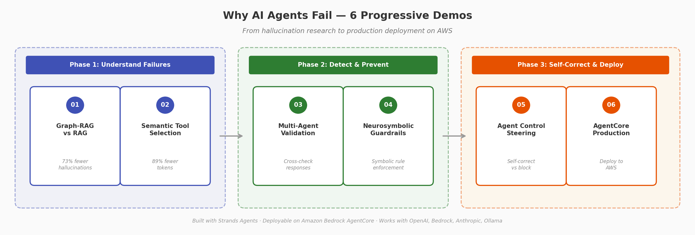
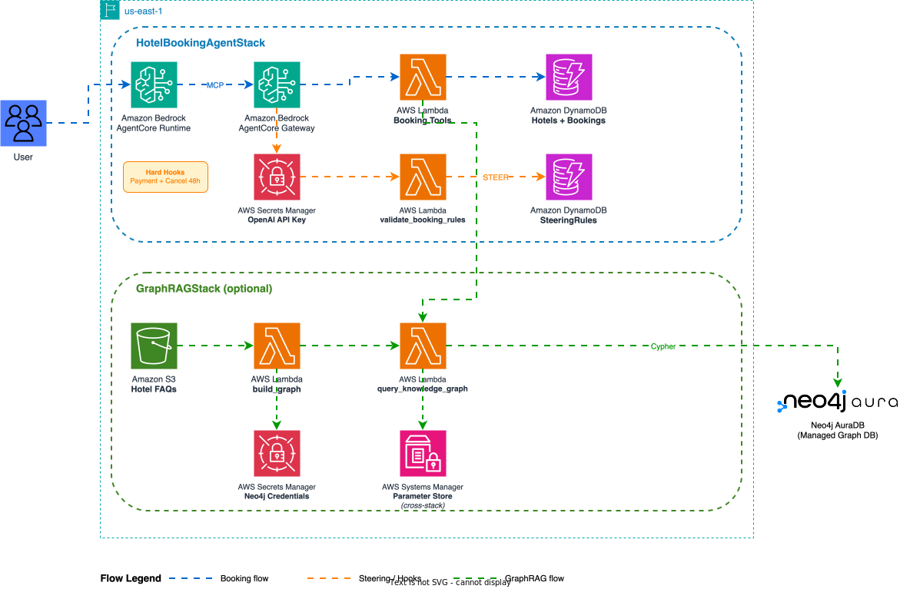

# Why AI Agents Fail: Stop Hallucinations with 6 Progressive Demos

[](https://python.org)
[](https://strandsagents.com)
[](https://aws.amazon.com/bedrock/agentcore/?trk=87c4c426-cddf-4799-a299-273337552ad8&sc_channel=el)
[](https://neo4j.com)
[](LICENSE)

> **AI agents hallucinate statistics, pick wrong tools, ignore business rules, and claim success when operations fail.** This repository provides 6 hands-on demos — from research-backed local experiments to production deployment on AWS — showing how to detect, prevent, and self-correct these failures using Graph-RAG, semantic tool filtering, multi-agent validation, neurosymbolic guardrails, [Agent Control](https://github.com/agentcontrol/agent-control) steering, and [Amazon Bedrock AgentCore](https://aws.amazon.com/bedrock/agentcore/?trk=87c4c426-cddf-4799-a299-273337552ad8&sc_channel=el) for production deployment.

Built with [Strands Agents](https://strandsagents.com). Similar patterns can be applied in LangGraph, AutoGen, CrewAI, or other agent frameworks.

> **Complexity note:** Demos 01-05 run locally with minimal setup. Demo 06 requires familiarity with [AWS CDK](https://aws.amazon.com/cdk/?trk=87c4c426-cddf-4799-a299-273337552ad8&sc_channel=el) and core AWS services. New to CDK? Start with the [CDK Workshop](https://cdkworkshop.com/) first.



---

## Demos

| # | Demo | What It Solves | Key Result | Stack |
|:-:|------|----------------|------------|-------|
| 01 | [Graph-RAG vs RAG](./01-faq-graphrag-demo/) | Fabricated statistics, incomplete retrieval, out-of-domain hallucination | 73% fewer hallucinations with knowledge graphs |   |
| 02 | [Semantic Tool Selection](./02-semantic-tools-demo/) | Wrong tool picks, token waste at scale (29 tools) | 89% token reduction, higher accuracy |   |
| 03 | [Multi-Agent Validation](./03-multiagent-demo/) | Undetected hallucinations, fabricated responses | Executor-Validator-Critic cross-check pipeline |  |
| 04 | [Neurosymbolic Guardrails](./04-neurosymbolic-demo/) | Agents ignoring business rules in prompts | Symbolic rules enforced via lifecycle hooks |  |
| 05 | [Agent Control Steering](./05-agent-control-demo/) | Hard-blocking stops the task instead of fixing it | Agent self-corrects instead of failing |  |
| 06 | [Amazon Bedrock AgentCore Production](./06-agentcore-production-demo/) | Taking all techniques to production on AWS | Full deployment with CDK, Lambda, DynamoDB, Amazon Bedrock AgentCore |    |

### Demo 06 — Production Architecture



---

## How the Demos Connect

Each demo builds on the previous one. You can run any demo independently, but the learning path is designed to be progressive:

**Phase 1 — Understand Failures:** Demos 01-02 show *why* agents fail — RAG hallucinations and tool selection errors backed by academic research.

**Phase 2 — Detect & Prevent:** Demos 03-04 show *how to catch* failures — multi-agent validation and symbolic rule enforcement.

**Phase 3 — Self-Correct & Deploy:** Demo 05 shows *how to steer* agents to self-correct instead of blocking (Agent Control), and Demo 06 shows *how to ship* all techniques to production on AWS (Amazon Bedrock AgentCore, DynamoDB, Lambda).

---

## Quick Start

### Prerequisites

- Python 3.9+
- [uv](https://docs.astral.sh/uv/) package manager
- [OpenAI API key](https://platform.openai.com/api-keys) (or any [Strands-supported provider](https://strandsagents.com/docs/user-guide/concepts/model-providers/): Amazon Bedrock, Anthropic, Ollama)

### Run Any Demo

```bash
cd 01-faq-graphrag-demo   # or any demo folder
uv venv && uv pip install -r requirements.txt

# Create .env with your API key
echo "OPENAI_API_KEY=your-key-here" > .env

# Run the demo
uv run <main_script>.py
# Or open the .ipynb notebook in your IDE (VS Code, Kiro, or any editor with notebook support)
```

Each demo README has specific setup instructions and prerequisites.

---

## Frequently Asked Questions

### What types of AI agent hallucinations does this repository address?

This repository addresses four main categories: **(1)** fabricated statistics — when RAG agents guess numbers instead of computing them, **(2)** wrong tool selection — when agents pick inappropriate tools from large toolsets, **(3)** business rule violations — when agents ignore constraints expressed only in prompts, and **(4)** undetected failures — when single agents claim success without validation.

### Can I use these patterns with frameworks other than Strands Agents?

Yes. The patterns (Graph-RAG, semantic tool filtering, multi-agent validation, neurosymbolic guardrails, steering controls) are framework-agnostic concepts. These demos use Strands Agents, but the same approaches apply in LangGraph, AutoGen, CrewAI, Haystack, or custom implementations. The key insight is architectural, not framework-specific.

### Do I need an AWS account to run the demos?

Only demo 06 (production deployment) requires an AWS account. Demos 01-05 run entirely locally with just Python and an OpenAI API key (or any supported LLM provider).

### How long does it take to run each demo?

Demos 02-05 run in under 5 minutes. Demo 01 has a lite mode (30 docs, ~15 minutes) and full mode (300 docs, ~2 hours) for building the knowledge graph. Demo 06 deployment takes ~20 minutes with CDK.

### What LLM providers are supported?

All demos default to OpenAI GPT-4o-mini but work with any provider supported by Strands Agents: Amazon Bedrock (Claude, Titan), Anthropic API, Ollama (local models), or any OpenAI-compatible endpoint. See [Strands Model Providers](https://strandsagents.com/docs/user-guide/concepts/model-providers/) for configuration.

---

## Troubleshooting

**OpenAI API errors:** Verify your `OPENAI_API_KEY` is set in a `.env` file. Get one at [platform.openai.com/api-keys](https://platform.openai.com/api-keys).

**Neo4j connection fails (demo 01):** Install [Neo4j Desktop](https://neo4j.com/download/) with the APOC plugin enabled, then restart.

**OpenTelemetry warnings:** "Failed to detach context" warnings in demos 03-05 are harmless and do not affect functionality.

**Model alternatives:** Change the model in any demo by modifying the `OpenAIModel()` constructor. See [Strands Model Providers](https://strandsagents.com/docs/user-guide/concepts/model-providers/) for all supported options.

For demo-specific issues, check the troubleshooting section in each demo's README.

---

## Security

If you discover a potential security issue in this project, notify AWS/Amazon Security via the [vulnerability reporting page](http://aws.amazon.com/security/vulnerability-reporting/?trk=87c4c426-cddf-4799-a299-273337552ad8&sc_channel=el). Please do **not** create a public GitHub issue.

---

## License

This library is licensed under the MIT-0 License. See the [LICENSE](LICENSE) file for details.

> Last updated: March 2026 | Strands Agents 1.27+ | Python 3.9+
